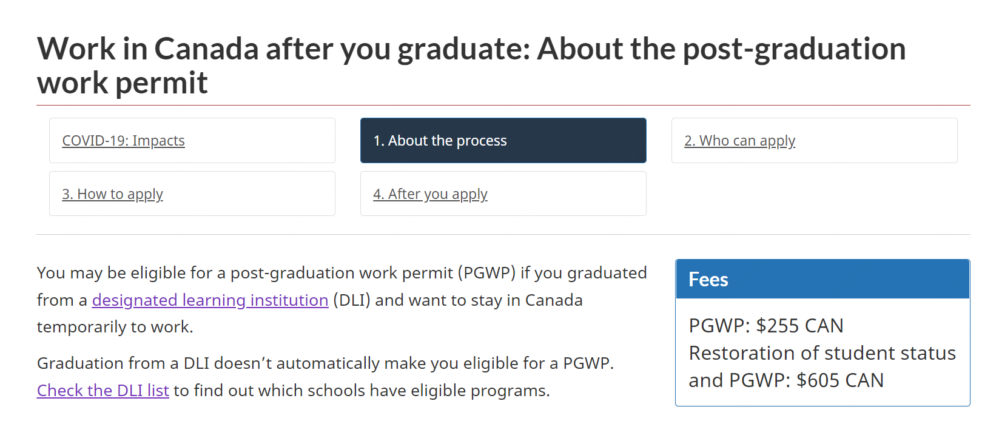

# run-to-ca

## 问题收集

😳 `以下答案可能带有强烈的主观体验，但是我会尽全力做到客观。`☺️

### 问题1：

> 想问一些关于在加拿大读college的问题。目前了解的信息是college比较好申，门槛也不算高，如果选择转码然后毕业找工作run这条路行不行得通？

是的，加拿大的college比university好申请的多，**最好优先申请带co-op的college转码，一放假就去实习，就业率不错的（企业用人真真真会优先雇佣有co-op experience的候选人，请一定一定考虑带co-op的tech program）**。

像在安省的话，有几家college都是蛮有名的，比如Toronto的Seneca、George Brown、Centennial和Waterloo的Conestoga等等等等（其实这几家college都是吃了地点的红利，毕竟trt和loo都是遍布科技公司啊）。BC省的college不太了解，看到很多人都在说BCIT（British Columbia Institute of Technology）不错？可以了解一下。

另外，有的university students，无论本专业是不是理工相关，也会选择在毕业后继续去college短期就读，目的就是迅速提高实战经验，毕竟很多人的本科/master的课程设置都是更重理论研究轻工业实践，而college的课程设置恰恰能弥补这一短板，更注重实践而不是理论，其实这对转码和找工作是友好的。我之前在实习的时候，同期有的intern或者full-time就是读的college，理论上不存在也不应当存在什么鄙视链。

### 问题2：

> 我目前在国内，文科出身现在做的是交付，刚刚开始零基础转码的阶段，但是因为个人资金不多，所以一开始在想能否通过转码后走工签润加拿大？看到加拿大魁省最新政策，是否要尝试开始学法语然后申学签？

就我个人的经验来看，如果不是加拿大留学僧的话，转码后直接申请工签难度很大很大。似乎先去国内外企，然后申请transfer到加拿大的可能性更大？但其实我觉得这个概率也是蛮微乎其微的。

提问的姐妹给我发了个链接，说的是魁省（Quebec）对国际学生友好的2023新政，满足条件后入校就读即可大幅度消减学费，意在吸引各种短缺劳动力，部分截图如下：

对于这项政策我觉得有几个要关注的点：

1. 满足条件学费降至3000加元/一学期，一学期4个月，一年3学期，一年学费约9000加元，以1：5的汇率，一年大约4w5的人民币，单从学费角度来看这个新政确实蛮吸引人的。
2. 必须就读于魁省**蒙特利尔市以外**的**法语**高等教育学校。我查了一下外网，原话应该是*"To qualify for the break-in tuition, foreign nationals need to be full-time students at either a college or university outside of **Greater Montreal in Quebec**"*。
   所以，不仅仅是不能就读于蒙特利尔市，而是不能就读于大蒙特利尔地区，我查了一下大蒙特利尔地区包括了Monetreal、Laval、Longueuil、North Shore、South Shore（ref: [Greater Montréal at a glance](https://www.montrealinternational.com/en/invest/geographic-zones/)）。

再来康康Quebec的按照人口排列的主要城市：

(ref: [CANADA: Quebec](http://www.citypopulation.de/en/canada/cities/quebec/))

所以要想满足新规的要求，主要能考虑的城市只有Quebec City和Gatineau了。魁省除了Montreal其他城市的科技工作岗位数量真的狠稀缺啊，而且基本是全法语。我觉得**没有法语基础的话，走这条路真的要慎重再慎重，前路漫漫望不到头啊**。

3. 去满足条件的法语高等教育学校就读毕业之后申请上的工签会不会受限制？譬如要求多少年内只能在某些区域工作，期限满后才解禁？不排除新规正式出来会不会有这个坑。

> ps：看了这个新规后，我似乎觉得通过读college润成功的可行性真的还蛮大。

### 问题3：

> 一是college也会有毕业的三年工签吗？二是零基础的话去college读cs项目会有入门困难的问题吗，还是只要保证雅思过关就好呢？

回答这个问题最最权威的就是加拿大移民局的官方问答了！在这里贴出原图：

总结来说：

- 只要你就读的学校是designated learning institution (DLI)，即可申请工签。如果想查看你想申请的学校在不在DLI list里，请戳官方网址[List of designated learning institutions by province/territory](https://www.canada.ca/en/immigration-refugees-citizenship/services/study-canada/study-permit/prepare/designated-learning-institutions-list.html)（一般正规的college都在这个list里，不过还是谨慎为妙！）。
- 如果你在加拿大读的项目大于8个月但是不满两年，你只能获得和你项目时长一样时效的工签，比如你读的项目时长9个月，即你申请的工签也只有9个月。
- 如果你在加拿大读的项目大于等于两年，你能获得3年时效的工签（强烈推荐！）。

原文可戳[How long is a post-graduation work permit valid?](https://www.canada.ca/en/immigration-refugees-citizenship/services/study-canada/work/after-graduation/about.html#pgwp_validity)。

另外，零基础去college读cs项目会有入门困难的问题么？答案是会有！想想看你零基础去国内培训班接受中文教学都会有入门困难的问题，答案是不是不言而喻了。不过，因为college的cs/engineering时长一般两年或以上，所以时间还是比较充足。在这个时间段里，你要学好英文（达到正常职场英文交流的水平就好，公司对技术人员的英文水平要求不会很高，大概雅思7分或以上），练好cs基础，准备面试（国外面试比国内简单的多的多）。平常高效利用时间，在这两年里多点吃苦的觉悟，面试之前尽量多点mock interview，找到心仪的技术工作成功率是还非常高的。